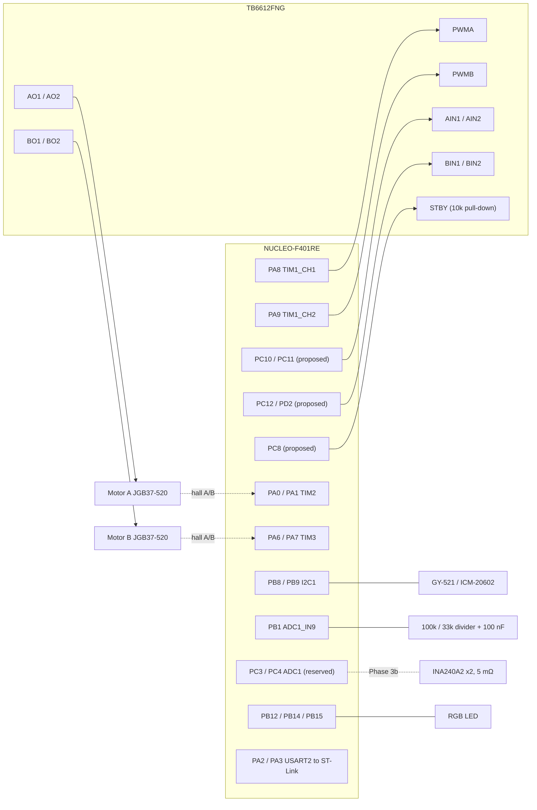
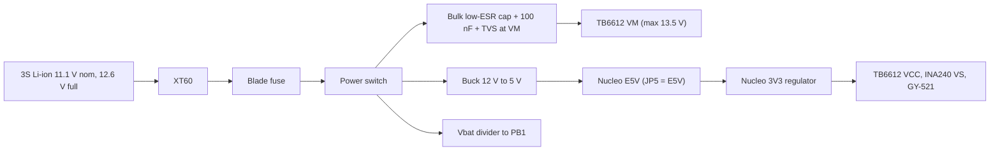

# v1 pin map — NUCLEO-F401RE + TB6612FNG + JGB37-520

Status: **DRAFT — Gate 0 pending.** Rows marked *proposed* become binding only after Arif confirms the as-wired pin.
Date: 2026-09-25. Board: NUCLEO-F401RE (MB1136), STM32F401RET6, LQFP64, 84 MHz.

Evidence labels: **PROVEN** = read in the current code (cited) · **PROPOSED** = this plan, not yet wired or confirmed · **PENDING** = needs Arif's as-wired answer.

## 1. Hard constraints

| Constraint | Source |
|---|---|
| SB62 / SB63 stay **OPEN**. PA2/PA3 reach the ST-Link VCP through SB13/SB14 only. No design may need them closed. | `PORTING_NOTES.md:142-152` |
| PB3 is SWO (SB15 ON). Never used as GPIO. | `PORTING_NOTES.md:150`, `PIN_ASSIGNMENTS.md:100-104` |
| PA13 / PA14 are SWD. | UM1724 |
| PA5 drives LD2 (SB21 ON). | `PORTING_NOTES.md:151` |
| PC13 is the B1 user button (SB17 ON), active LOW. | `main.c:912-916` |
| TB6612 STBY must be LOW from power-on until firmware releases it. | prompt §3 |

## 2. Pin table

This table is the single source that `firmware/Core/Inc/pins.h` will mirror from Phase 2 (checked by `scripts/check_pin_consistency.py`).

| Pin | Header | Function | Peripheral / AF | Status | As-wired |
|---|---|---|---|---|---|
| PA0 | CN7-28 | Encoder A ch A | TIM2_CH1, AF1 | PROVEN `msp.c:173-179` | PENDING |
| PA1 | CN7-30 | Encoder A ch B | TIM2_CH2, AF1 | PROVEN | PENDING |
| PA2 | CN10-35 | VCP TX 921600 | USART2_TX, AF7 | PROVEN `msp.c:23-29` | fixed |
| PA3 | CN10-37 | VCP RX | USART2_RX, AF7 | PROVEN | fixed |
| PA5 | CN10-11 | LD2 heartbeat | GPIO out | PROVEN `main.c:904-906` | fixed |
| PA6 | CN10-13 | Encoder B ch A | TIM3_CH1, AF2 | PROVEN `msp.c:185-191` | PENDING |
| PA7 | CN10-15 | Encoder B ch B | TIM3_CH2, AF2 | PROVEN | PENDING |
| PA8 | CN10-23 | **PWMA** | TIM1_CH1, AF1 | fixed by prompt | PENDING |
| PA9 | CN10-21 | **PWMB** | TIM1_CH2, AF1 | fixed by prompt | PENDING |
| PB1 | CN10-24 | Vbat divider 100k/33k | ADC1_IN9 | PROVEN `msp.c:117-118` | PENDING |
| PB2 | CN10-22 | Fault LED | GPIO out | PROVEN `main.c:908-910` | fixed |
| PB8 | CN10-3 | IMU SCL (GY-521, ICM-20602) | I2C1_SCL, AF4, OD | PROVEN `msp.c:148-155` | PENDING |
| PB9 | CN10-5 | IMU SDA | I2C1_SDA, AF4, OD | PROVEN | PENDING |
| PB12 | CN10-16 | RGB red | GPIO out | PROVEN `rgb_led.c:10-11` | confirmed (D-C) |
| PB14 | CN10-28 | RGB green | GPIO out | PROVEN `rgb_led.c:12-13` | confirmed (D-C) |
| PB15 | CN10-26 | RGB blue | GPIO out | PROVEN `rgb_led.c:14-15` | confirmed (D-C) |
| PC3 | CN7-37 | INA240 A out — **reserved, not fitted** | ADC1_IN13 | PROPOSED (Phase 3b) | not fitted |
| PC4 | CN10-34 | INA240 B out — **reserved, not fitted** | ADC1_IN14 | PROPOSED (Phase 3b) | not fitted |
| PC10 | CN7-1 | **AIN1** | GPIO out, resets LOW | PROPOSED | PENDING |
| PC11 | CN7-2 | **AIN2** | GPIO out, resets LOW | PROPOSED | PENDING |
| PC12 | CN7-3 | **BIN1** | GPIO out | PROPOSED | PENDING |
| PD2 | CN7-4 | **BIN2** | GPIO out | PROPOSED | PENDING |
| PC8 | CN10-2 | **STBY** (+ external 10 kΩ pull-down) | GPIO out, driven LOW first | PROPOSED | PENDING |
| PC13 | CN7-23 | B1: arm / disarm / fault reset (long press) | GPIO in, pull-up | PROVEN `main.c:912-916` | fixed |
| PB10 | CN10-25 | IMU INT (optional) | EXTI10 | PROPOSED, only if wired | PENDING |

Reserved, never assigned: PA13, PA14, PB3.

Released by v1: PB6, PB7 (TIM4, old Motor B PWM), PC6, PC7 (USART6, kept for the ESP32 bridge only in the `MICROROS=ON` build). PC10/PC11 change role from DBH-12V enable to AIN1/AIN2 under the proposal.

Still free: PA4, PA10, PA11, PA12, PA15, PB0, PB4, PB5, PB6, PB7, PB13, PC0, PC1, PC2, PC5, PC9, and PC6/PC7 in the serial build.

## 3. Conflict checks

| Check | Result |
|---|---|
| Motor B encoder timer | TIM3 on PA6/PA7 already exists and is wrap-safe (`encoder.c:27-32`). No new timer needed. |
| SB62/SB63 | No v1 signal touches PA2/PA3 or needs D0/D1. |
| RGB LED pins | PB12/PB14/PB15 are not shared with any new signal. |
| VCP | USART2 PA2/PA3 unchanged. |
| TIM10 / TIM11 | Time bases with no pins. Unchanged. |
| PWMB moving to TIM1_CH2 | TIM4 becomes free. PB6/PB7 are the only other encoder-capable pair on this package, kept as a fallback. |
| ADC trigger | TIM1 TRGO = UPDATE, internal. No pin. |
| SWO / SWD | PB3, PA13, PA14 untouched. |

## 4. Timers

| Timer | v1 role | Phase |
|---|---|---|
| TIM1 | Center-aligned PWM A/B, ARR 2099 → 20 kHz, RCR 1, TRGO = UPDATE (counter valley) | 2 |
| TIM2 | Encoder A, 32-bit | unchanged |
| TIM3 | Encoder B, 16-bit | unchanged |
| TIM4 | Free (fallback encoder pair PB6/PB7) | 2 |
| TIM10 | 1 kHz control ISR, prio 1; angle loop every `ANGLE_DIV` ticks | 4 |
| TIM11 | 50 Hz telemetry decimation | unchanged |
| TIM5, TIM9 | Free, time base only | — |

## 5. ADC

| Channel | Pin | Group | Trigger | Notes |
|---|---|---|---|---|
| IN9 | PB1 | Regular, DMA circular | continuous | ≥ 84-cycle sampling; add 100 nF PB1→GND at the divider (source ≈ 25 kΩ) |
| IN13 | PC3 | Injected rank 1 | TIM1 TRGO (valley) | Phase 3b, INA240 A |
| IN14 | PC4 | Injected rank 2 | TIM1 TRGO (valley) | Phase 3b, INA240 B |

Vbat scaling: 13.0 V × 33/(100+33) = 3.23 V, under the 3.3 V reference with 74 mV margin.

INA240A2 build spec (Arif, 2026-09-25): gain 50 V/V, 5 mΩ shunt in-line in each motor lead, REF1 → VS, REF2 → GND, VS = 3.3 V. Zero at 1.65 V, 0.25 V/A, ±6.6 A full scale, ≈ 3.2 mA/LSB. Samples with |duty| below ~5 % are flagged low-confidence.

## 6. Wiring diagram

## 7. Power path

Values marked ASSUMED until measured: fuse rating (7.5 A fast, final from B6/B11), bulk capacitor (≥ 1000 µF 25 V), TVS (SMBJ13A class). The bulk capacitor absorbs regen and ringing; a TVS clamps above 15 V at high current, so ringing at VM is checked on the scope in B11.

**Phases 2 to 4 run from a bench PSU at 12.0 V with a 3 A current limit.** The battery and fuse are used only from Phase 3b, once current sensing is fitted.

## 8. UM1724: powering from E5V with the ST-Link USB connected

**UNKNOWN — not yet quoted.** The note must be quoted verbatim from UM1724 with its revision, not paraphrased from memory.
On 2026-09-25 st.com could not be reached from `siot-dev-m5`: curl failed with an HTTP/2 stream error and then timed out over HTTP/1.1, and a proxied fetch also timed out. No local copy of UM1724 exists under `~/Downloads`, `~/Documents` or `~/Developer`.

To close this item: drop the UM1724 PDF into `docs/ref/` (or retry the download), then quote the E5V / JP5 passage and the power-up order between E5V and the ST-Link USB here.
Until then the E5V choice in section 7 is ASSUMED.

## 9. Gate 0 — answers needed from Arif

| # | Question | Answer |
|---|---|---|
| 1 | AIN1 / AIN2 / BIN1 / BIN2 / STBY pins as wired | PENDING |
| 2 | PWMA = PA8, PWMB = PA9? Encoders still PA0/PA1 and PA6/PA7? | PENDING |
| 3 | INA240 | **Not fitted.** Spec above. |
| 4 | Vbat divider still 100k/33k on PB1? | PENDING |
| 5 | Nucleo power: buck 5 V → E5V, or VIN? | PENDING |
| 6 | STBY pull-down fitted? One TB6612 module or two? | PENDING |
| 7 | GY-521 on PB8/PB9? INT pin wired? | PENDING |
| 8 | RGB common anode or common cathode? | PENDING |
